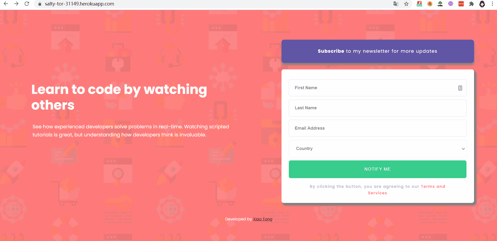

# Express Deployed News Letter Sign Up Page

### [News Letter Sign Up Page](https://salty-tor-31149.herokuapp.com/)

## SKILLS:
#### It covers the knowledge of **_HTML, CSS, Bootstrap,  Js, backend Node.js and  Express**

## HOW DOES IT WORK:
#### The project is run on local server and deployed by Node.js.  The repo contains the backend file: app. js which I run through by nodemon (a package installed through npm: node package manager) to simplify the node.js restart procedures in terminal. 

## FINAL PRODUCT: 

